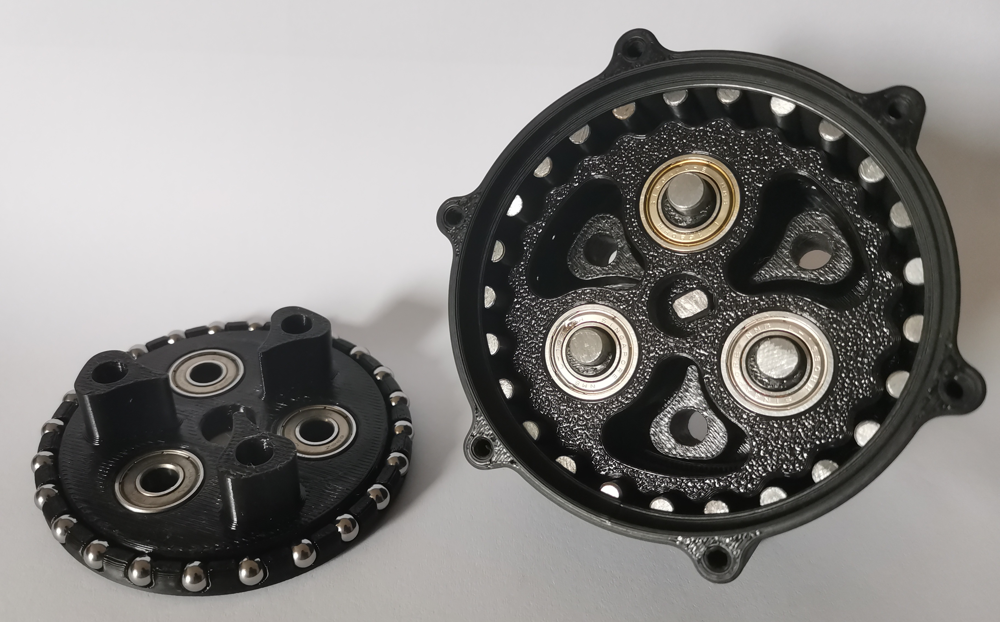

# Parametric RV reducer

Parametric Rotate Vecor (RV) reducer designed in Onshape  
A RV reducer is a combination of planetary gears and cycloidal drive  
Here are examples of RV reducers:  
- [Industrial example](https://www.youtube.com/watch?v=Ttb4dIUiQWk)
- [Morse Dynamics](https://www.instagram.com/morsedynamics/)
- [Michael Rechtin](https://www.youtube.com/watch?v=IKkw4d7jyu0&t=21s)

## Main project

  
Here is the link to the main [Onshape project](https://cad.onshape.com/documents/2b52985c37cc494e3507f282/w/50bf925fc91c4350ebe27855/e/7928599eb972c3e2a49f81f0?renderMode=0&uiState=686a6db617a27d4a00ee71ca)  
The first draft of the main document is almost finished.

This first document is an RV reducer that uses:
- metal dowel for the outer pins
- metal bearing balls and 3d printed bearing race to replace costly and overkill large bearing

## To Do

| Progress | Tasks |
| --- | --- |
|  | Add python calculator documentation |
|  | Add overall documentation |
|  | Weight optimization |
|  | Adding housing mounting options |
