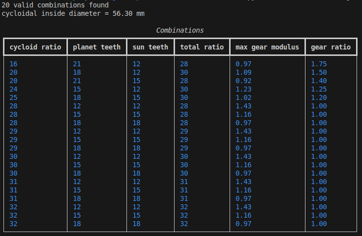

# Gear teeth calculator

## Purpose
The gear teeth calculator is meant to:
- calculate the number of teeth per sun and planets to fit inside the cycloidal disk
- calculate the cutout diameter inside the cycloidal disk
- get round number as reduction ratio for easier calculation in software

## Package to install
`pip install rich`

## Parameters  

## Result filters
### Result:  

### Result where planet teeth = sun teeth are filtered out (`unit_gear_ratio = False`)

### Result if filtered by exact modulus (`filter_by_given_modulus = True`)

